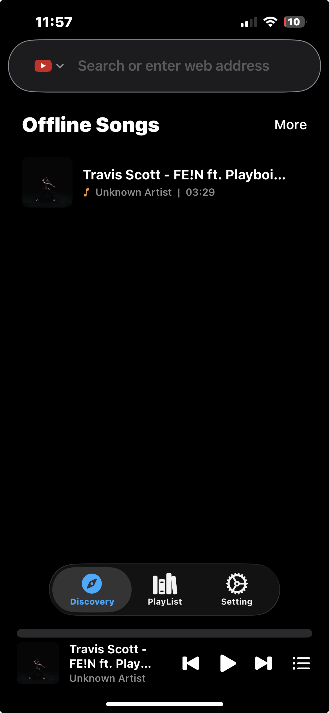
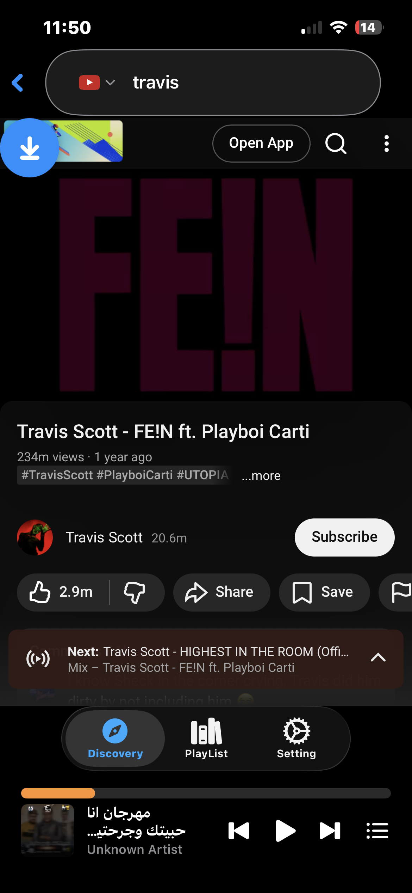
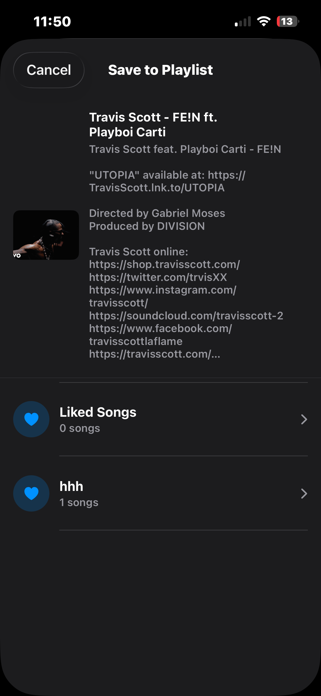
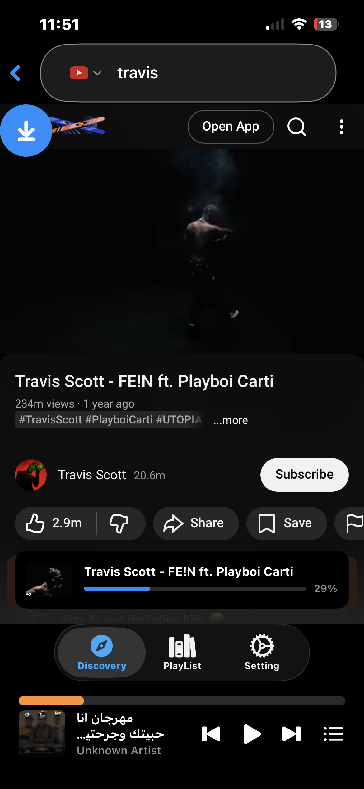
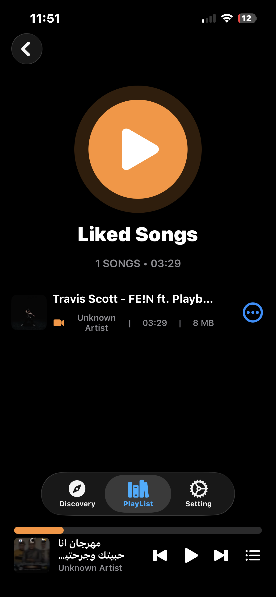
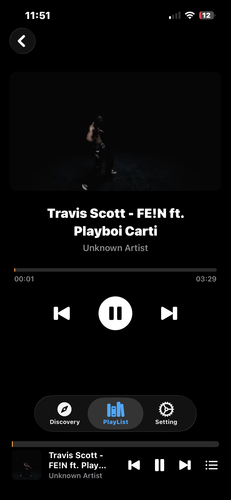

# Offline Music Player for iOS

A fully-featured offline music player built with **SwiftUI** that lets you browse YouTube, download videos as audio/video files, organize them into playlists, and play them locally — no internet needed after download.

## Features

### Discovery & Search

Browse YouTube directly inside the app using an embedded WebView. Search for any song, video, or artist with the built-in search bar that supports YouTube and Google search engines.


<p align="center">
  
</p>
<p align="center">
  
</p>

- Offline Songs section on the home screen with thumbnails and quick access
- Embedded YouTube browser with full navigation
- Search bar with YouTube and Google engine support
- Detects YouTube video URLs automatically (standard links, shorts, embeds)
- Mini player persists at the bottom while browsing

---

### Download & Save to Playlist

When you find a video you want, tap the download button to save it directly to any of your playlists. The app extracts the best available audio/video stream and downloads it in the background.

<p align="center">
  
</p>

- Displays video metadata (title, artist, description, thumbnail) before downloading
- Choose which playlist to save the download to
- Supports multiple video codecs (H.264, VP9, AV1)
- Automatic best-quality stream selection

---

### Background Downloads with Progress Tracking

Downloads run in the background so you can keep browsing or listening. A progress banner shows real-time download percentage directly on the discovery page.

<p align="center">
  
</p>

- Real-time progress bar with percentage indicator
- Background download support via URLSession
- Local push notifications for download start, progress, and completion
- Automatic file naming and format detection based on codec

---

### Playlist Management

Organize your downloaded music into custom playlists. Each song displays its title, artist, duration, and file size. A default "Liked Songs" playlist is created automatically.

<p align="center">
  
</p>

- Create, browse, and delete custom playlists
- View song metadata: title, artist, duration, file size
- Context menu actions: add to queue, copy to another playlist, delete
- Swipe actions for quick song management
- Playlist data persisted with Core Data

---

### Full-Featured Music Player

Tap any song to open the full player view with video thumbnail, interactive seek bar, and playback controls. Supports lock screen and Control Center integration.

<p align="center">
  
</p>

- Interactive progress bar with drag-to-seek
- Play, pause, skip next, skip previous controls
- Lock screen and Control Center Now Playing integration
- Remote command support (headphones, CarPlay)
- Audio session interruption handling (calls, alarms)
- Automatic pause when headphones are unplugged
- Queue management with shuffle support
- Session restore — resumes your last played song on app launch

---

## Tech Stack

| Component | Technology |
|---|---|
| UI | SwiftUI |
| Audio Playback | AVFoundation (AVPlayer, AVAudioSession) |
| Video Playback | AVKit |
| Media Controls | MediaPlayer (MPRemoteCommandCenter, MPNowPlayingInfo) |
| Web Browsing | WebKit (WKWebView) |
| Data Persistence | Core Data |
| Networking | URLSession (background sessions) |
| Notifications | UserNotifications |
| YouTube Extraction | YouTubeKit |
| Concurrency | Swift async/await |

## Architecture

```
Discovery Page → WebView (YouTube) → YouTubeExtractor
    ↓
DownloadManager → URLSession (background download)
    ↓
FileManagerHelper → Save to playlist folder
    ↓
SongManager → Extract metadata (title, artist, duration, thumbnail)
    ↓
AudioManager → Queue and playback with lock screen integration
```

**Key Managers:**
- **AudioManager** — Singleton handling AVPlayer, audio session, Now Playing info, and remote commands
- **DownloadManager** — Manages background download tasks with progress tracking
- **PlaylistManager** — Core Data CRUD operations for playlists
- **SongManager** — File scanning and metadata extraction via AVURLAsset
- **SnapshotManager** — Persists last played song/playlist for session restore

## Requirements

- iOS 16.0+
- Xcode 15+
- Swift 5.9+

## Getting Started

1. Clone the repository
   ```bash
   git clone https://github.com/your-username/offline-music-player.git
   ```
2. Open `aboutme.xcodeproj` in Xcode
3. Build and run on a simulator or physical device

## License

This project is for educational purposes.
